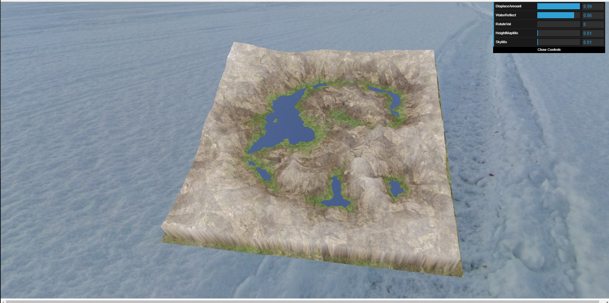

# CMPC163_HW2
Alfredo Cuevas
acuevas5@ucsc.edu

I use the three.js code inside of the js/ folder. Most of the code inside the js/ folder was not written by me.

Volcano OBJ file obtained at https://poly.google.com/view/dwSigTeSMCo

PartA- <b>HW2PartA.html</b>
My code creates a small square of terrain using a heightmap with a texture. The water is is created by making a plane intersect with the terrain. The water by default will reflect the skybox that I have placed around the scene. I use Orbit controls which was shown to us in class. I also use dat.gui to control some of the parameters for the objects. I used code provided in class and tweeked it so that my textures and dat.gui parameters worked together.  
