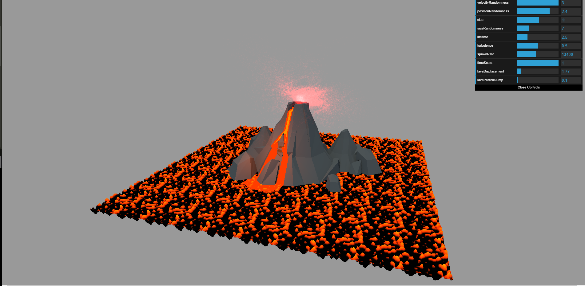

# CMPC163_HW2
Alfredo Cuevas
acuevas5@ucsc.edu

I use the three.js code inside of the js/ folder. Most of the code inside the js/ folder was not written by me.

Volcano OBJ file obtained at https://poly.google.com/view/dwSigTeSMCo

PartA- <b>HW2PartA.html</b>
My code creates a small square of terrain using a heightmap with a texture. The water is is created by making a plane intersect with the terrain. The water by default will reflect the skybox that I have placed around the scene. I use Orbit controls which was shown to us in class. I also use dat.gui to control some of the parameters for the objects. I used code provided in class and tweeked it so that my textures and dat.gui parameters worked together.  

PartB- <b>HW2PartB.html</b>
My code uses the GPUParticleSystem shown in class to try and create lava coming out of a volcano. At first it was meant to be smoke however for some reason I was having problems with the particle system. I found that there were some other people from class that had this same issue. My solution was simply to hard code the colors into the GPUParticleSystem file. All I did was change the fragment shader a little bit. I also included a Volcano object that I downloaded off of Google Poly (https://poly.google.com/view/dwSigTeSMCo). Finally I used the perlin noise example from class to create a lava floor. I included some variables that can be altered using the dat.gui. Part B of this homework was surprisingly difficult for me. I had problems getting the particles to do anything I wanted. The end result is lava particles with a lava floor and som adjustable variables. 
